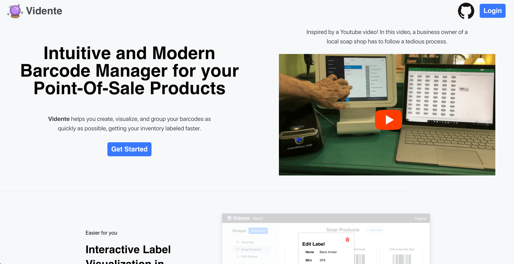

# Vidente
> Cloud-based Label Manager for your Point-Of-Sale Products

Vidente is a full-stack project that aims to help you create, visualize, and group your barcodes as
quickly as possible, getting your inventory labeled faster.

## Project Architecture
The main components of this project include
- The entry point of application that will serve our API, 
the React application, as well as a static website in app.js
- A React SPA which is this projects main functionality found in app_server/vidente-app/
- Express API along with the database models found in app_api/ folder
- A template-driven static website generated by Pug that shows
Vidente's features found mainly in app_server/views/

## Screenshots
### Login/Register/Demo Screen

### Main React Application

### Informational Static Website

## Inspiration
This project was inspired by 
[this youtube video](https://www.youtube.com/watch?v=rUuUGIzY6as).
In this video, a business owner of a local soap shop 
has to follow a tedious process.

